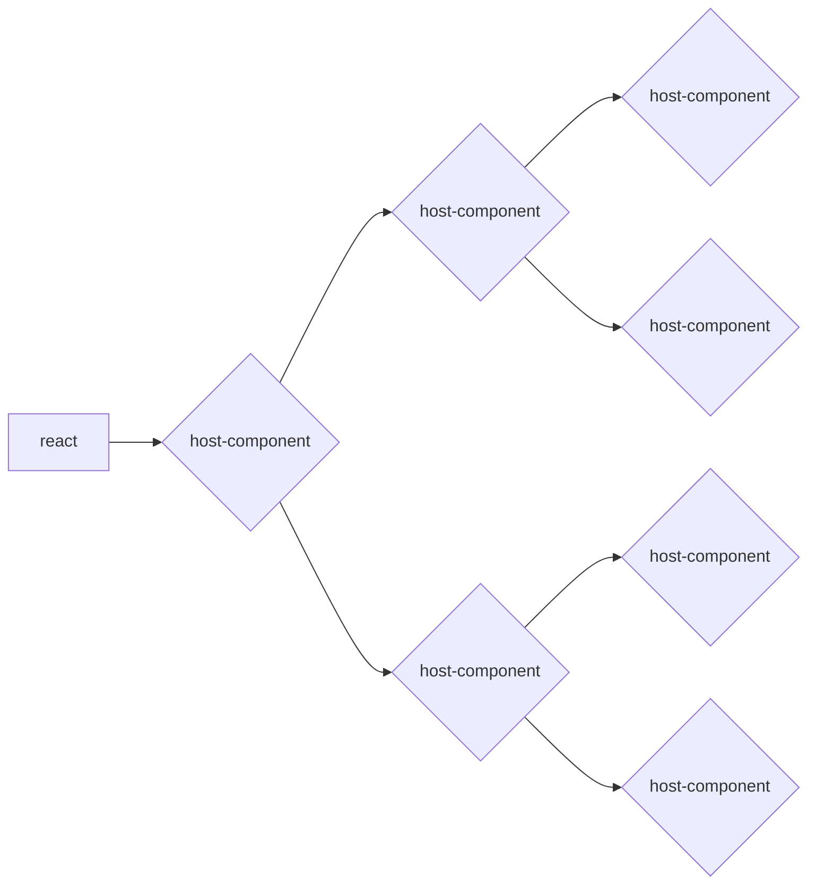

TODO：

1. 确定递归算法，找到所有的树

   1.1 fix：单元测试无法运行[]

   1.2 遍历进入其他第三方模块（比如 antd),来确定 host-component 是什么[]

   1.3 fix：单元测试无法运行=

2. 实现@colliejs/core 中的 cx 方法[]

```mermaid
graph LR
A[react] --> B{host-component}
B --> C{host-component}
B --> D{host-component}
C --> E{host-component}
C --> F{host-component}
D --> G{host-component}
D --> H{host-component}
```
